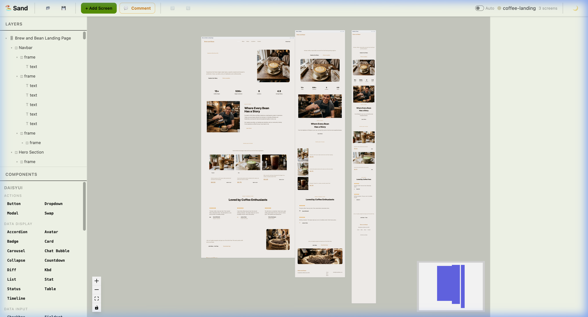
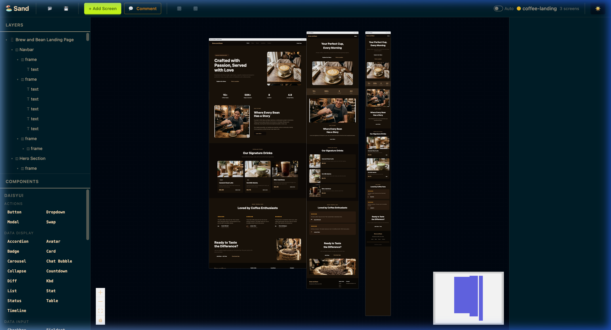
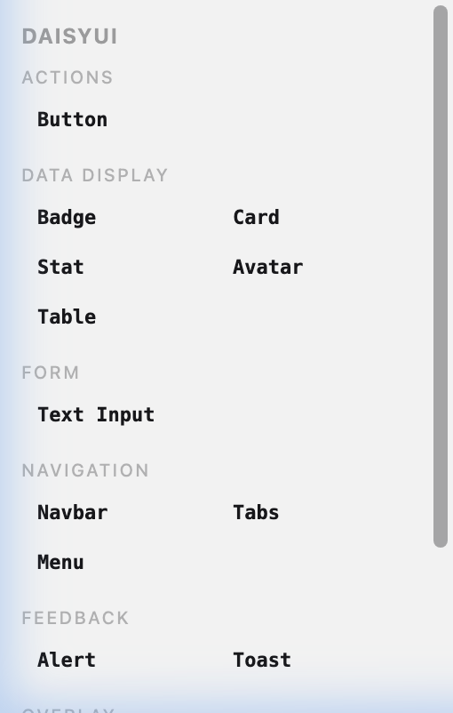
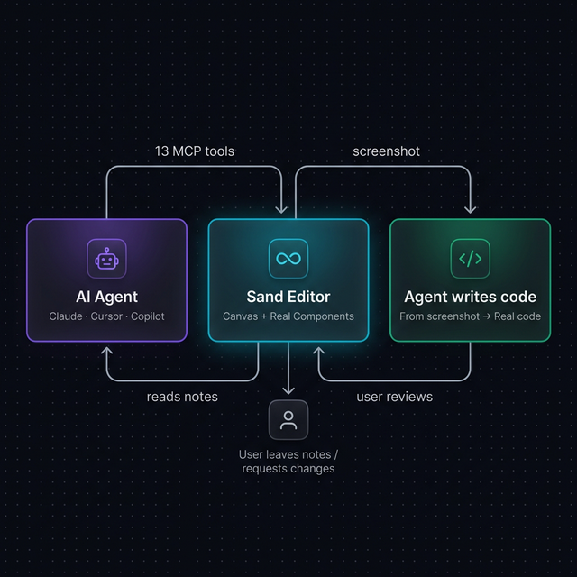

# Sand 🏖️

**AI-Native Design Tool** — Open-source visual communication between humans and AI agents.

[](LICENSE)

> *Agent designs → Screenshot → Agent codes. Human reviews → Notes → Agent iterates.*

Sand is an AI-first design tool where **designs render actual React components**. Unlike traditional design tools that use vector primitives, Sand renders real UI library components (daisyUI, your own design system) on an infinite canvas — what you see is literally what gets built.

## 📸 Screenshots

| Light Mode | Dark Mode |
|---|---|
|  |  |

<details>
<summary>Component Panel</summary>


</details>

## ✨ Features

- **🎨 Real Component Rendering** — Designs use actual React components, not visual approximations
- **🤖 13 MCP Tools** — Full AI agent integration via Model Context Protocol (stdio)
- **📦 Adapter System** — Bring your own UI library (daisyUI included, add any React lib)
- **📸 Screenshot Capture** — Production-quality PNG exports for agent-driven code generation
- **💬 Notes & Comments** — Human ↔ Agent feedback loop with threaded conversations
- **📐 Flexbox Layout** — Auto-layout with gap, padding, alignment, `fill_container` sizing
- **🎭 Themes & Variables** — Design tokens with multi-theme support (dark/light)
- **↩️ Undo/Redo** — Full history with Immer patches
- **📱 Responsive Design** — Multiple breakpoint screens (Desktop/Tablet/Mobile)
- **🗂️ File Format** — `.sand` JSON files, Git-friendly, Zod-validated

## 🚀 Quick Start

```bash
git clone https://github.com/kno-raziel/sand-canvas.git
cd sand-canvas
pnpm install
pnpm --filter @sand/editor dev   # Editor at http://localhost:4003
```

## 📦 Packages

| Package | Description |
|---------|-------------|
| [`@sand/core`](packages/core/) | Headless document engine — Zod schemas, node types, adapter interface, CSS-Class Engine |
| [`@sand/mcp-server`](packages/mcp-server/) | MCP stdio server with 13 tools for AI agent integration |
| [`@sand/adapter-daisyui`](packages/adapter-daisyui/) | daisyUI component adapter — 14 components across 8 categories |
| [`@sand/editor`](apps/editor/) | Vite + React canvas editor with @xyflow/react |

## 🏗️ Architecture



### Key Design Decisions

- **Sand never generates code.** Code generation is the agent's responsibility.
- **Designs render actual React components** — what you see is what gets built.
- **Screenshots are the primary output** — higher quality rendering → better agent code.
- **Notes/comments** close the feedback loop between human intent and agent execution.
- **Bring your own UI library** — adapters integrate any component library.

## 🤖 MCP Tools

Sand includes a complete MCP server with 13 tools:

| Tool | Type | Description |
|------|------|-------------|
| `get_editor_state` | Read | Active document, open files, schema version |
| `batch_get` | Read | Read nodes by ID or search patterns |
| `batch_design` | Write | Insert/Update/Delete/Copy/Replace/Move/Generate operations |
| `open_document` | Utility | Open or create `.sand` files |
| `get_screenshot` | Read | DOM-to-PNG capture via WebSocket bridge |
| `snapshot_layout` | Read | Layout rectangles with problem detection |
| `get_variables` / `set_variables` | Read/Write | Design token and theme definitions |
| `find_empty_space` | Utility | Find available canvas space |
| `search_unique_properties` | Read | Find unique property values across a subtree |
| `replace_matching_properties` | Write | Bulk-replace property values |
| `get_guidelines` | Read | Design guidelines by topic |
| `reply_conversation` | Write | Reply to comment threads |

## 🧩 Creating Your Own Adapter

Sand's adapter system lets you integrate any React component library. Each adapter provides:

1. A list of components with their prop schemas
2. A render function for each component
3. Default prop values

The **daisyUI adapter** uses the CSS-Class Engine — components are just ~10 lines of declarative data:

```typescript
{
  name: "Button",
  element: "button",
  baseClass: "btn",
  modifiers: {
    variant: { prefix: "btn-", values: ["primary", "secondary", "accent"] },
    size: { prefix: "btn-", values: ["xs", "sm", "md", "lg"] },
  },
  booleans: { outline: { class: "btn-outline" } },
  content: "label",
}
```

For React component libraries, use the **React Wrapper** adapter pattern — see [`@sand/core` docs](packages/core/README.md).

## 📁 File Format

Sand uses `.sand` files — JSON documents validated with Zod:

```jsonc
{
  "version": 1,
  "variables": { /* design tokens, themes */ },
  "children": [
    {
      "id": "screen-1",
      "type": "frame",
      "name": "Dashboard",
      "width": 1440, "height": 900,
      "layout": "vertical",
      "children": [
        { "id": "title", "type": "text", "content": "Hello Sand!" },
        { "id": "btn", "type": "ref", "ref": "daisyui-button" }
      ]
    }
  ]
}
```

## 🛠️ Tech Stack

| Layer | Technology |
|-------|------------|
| Canvas | `@xyflow/react` v12+ |
| UI | React 19 |
| State | Zustand + Immer |
| Schema | Zod |
| Styling | Tailwind CSS 4 + daisyUI 5 |
| MCP | `@modelcontextprotocol/sdk` (stdio) |
| Screenshots | `html-to-image` |
| Build | Vite 7 |

## 🤝 Contributing

See [CONTRIBUTING.md](CONTRIBUTING.md) for setup instructions, coding guidelines, and how to add components or create adapters.

## 📜 License

[MIT](LICENSE) — Free for personal and commercial use.

---

*Sand is inspired by [Pencil.dev](https://pencil.dev), the proprietary AI design tool. Sand is the open-source MIT alternative with one key differentiator: designs render actual React components.*
